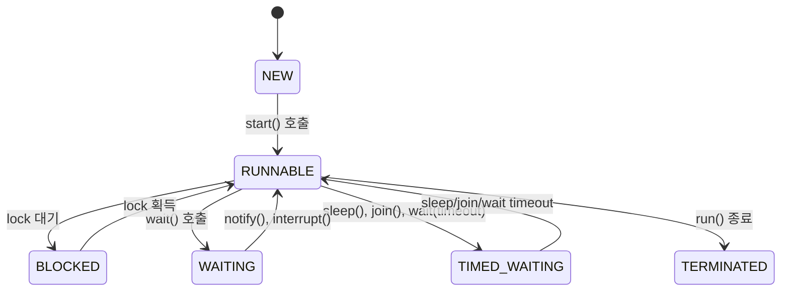

# Java 메모리 모델(JMM)과 스레드 

---

## 📌 1. 하드웨어의 메모리 계층과 일관성 문제
멀티스레드 환경에서는 **CPU 캐시 계층 구조와 메모리 동기화 문제**를 반드시 이해해야 한다.

### ✅ CPU 캐시 계층 구조
- **L1 캐시 (CPU 내부, 초고속, 매우 작음)**
- **L2 캐시 (고속, L1보다 큼)**
- **L3 캐시 (모든 코어가 공유, 느림)**
- **메인 메모리 (RAM, 캐시에 비해 매우 느림)**
- **디스크 (SSD/HDD, RAM보다 훨씬 느림)**

### ✅ 멀티스레드 환경에서 발생하는 문제
> **각 CPU 코어는 독립적인 캐시를 사용하며, 변경된 데이터가 공유 메모리에 즉시 반영되지 않을 수 있다.**  
> **결과적으로, 스레드 A가 변경한 값이 스레드 B에서는 보이지 않는 메모리 불일치 문제가 발생한다.**

---

## 🚀 2. 자바 메모리 모델(JMM)의 핵심 역할
- **JMM은 멀티스레드 환경에서 변수의 값을 어떻게 읽고 쓰는지 정의하는 모델.**
- **CPU 캐시, 메인 메모리, 레지스터 간 데이터 일관성을 유지하는 방법을 제공.**
- **JMM을 이해하면 `volatile`, `synchronized`, `atomic` 같은 키워드의 역할을 정확히 파악 가능.**

---

### JMM에서 정의하는 8가지 연산(기본 원자적 연산)
-  JMM은 멀티스레드 환경에서 변수의 값을 읽고 쓰는 방식에 대해 8가지 연산을 정의함.
-  **이 연산들은 "각각 하나의 연산으로 보장"되어야 하며, 중간에 끼어들 수 없음.**

| **연산** | **설명** |
|---------|------------------------------|
| `read` | 변수 값을 메인 메모리에서 가져옴 |
| `load` | CPU 캐시에 값을 적재 |
| `use` | 연산을 위해 CPU 레지스터에서 값 사용 |
| `assign` | 변수에 새로운 값을 저장 |
| `store` | CPU 캐시에서 메모리로 값 저장 |
| `write` | 변수 값을 메모리에 실제 반영 |
| `lock` | 변수에 대한 배타적 접근(락 설정) |
| `unlock` | 락 해제 후 다른 스레드 접근 가능 |
 
- **즉, 변수 하나를 읽고 업데이트할 때도 최소 `read → load → use → assign → store → write` 과정을 거친다.**
- **이 과정에서 중간에 다른 스레드가 개입하면 "레이스 컨디션(Race Condition)"이 발생할 수 있음!**


### JMM에서 지켜야 하는 규칙(메모리 일관성 보장)
✅ **JMM은 멀티스레드 프로그래밍에서 변수 간의 관계를 정리한 규칙을 제공.**
✅ **이 규칙을 기억하면 동기화 문제를 예방할 수 있음!**

### **🚀 1. 프로그램 순서 규칙(Program Order Rule)**
✅ **같은 스레드에서 실행되는 코드들은 작성된 순서대로 실행됨.**
```java
int x = 1;
int y = 2;
```
✅ **위 코드는 항상 `x=1`이 먼저 실행된 후 `y=2`가 실행됨. (단일 스레드 기준)**

---

### **🚀 2. Volatile 변수 규칙(Volatile Variable Rule)**
✅ **`volatile` 변수의 값 변경은 모든 스레드에서 즉시 반영됨.**
```java
volatile boolean flag = false;
flag = true;  // 다른 스레드도 즉시 반영됨!
```
✅ **일반 변수와 달리, `volatile` 변수는 캐시에 저장되지 않고 항상 메인 메모리에서 읽고 씀!**

---

### **🚀 3. 잠금 규칙(Lock Rule)**
✅ **synchronized 블록 안에서 실행된 모든 연산은, 해당 블록이 끝난 후 다른 스레드에서도 보장됨.**
```java
synchronized (this) {
    sharedVariable = 42;  // 락을 잡고 변경
}
```
✅ **이 블록을 빠져나오면 다른 스레드는 `sharedVariable = 42`를 보장받을 수 있음!**

---

### **🚀 4. 전이성 규칙(Transitivity Rule)**
✅ **A → B, B → C가 성립하면 A → C도 보장됨.**
```java
Thread 1: x = 1; // A
Thread 2: y = x; // B
Thread 3: z = y; // C
```
✅ **이 경우, `Thread 3`은 `z = 1`이 되는 것이 보장됨.**

---

### **🚀 5. 스타트-종료 규칙(Start-Join Rule)**
✅ **Thread.start()가 실행된 후, 해당 스레드 내부 연산들은 `join()` 호출 후 보장됨.**
```java
Thread t = new Thread(() -> counter = 10);
t.start();
t.join();
System.out.println(counter); // 항상 10 보장
```
✅ **즉, `join()`을 사용하면 해당 스레드의 작업이 끝난 후 메모리 값이 동기화됨.**

---

### ✅ JMM이 해결하는 3가지 주요 문제
| 개념 | 설명 | 해결책 |
|------|------|------|
| **원자성(Atomicity)** | 연산이 중간에 끊기지 않고 한 번에 실행되는가? | `synchronized`, `AtomicInteger` |
| **가시성(Visibility)** | 한 스레드가 변경한 변수를 다른 스레드가 볼 수 있는가? | `volatile`, `synchronized` |
| **실행 순서(Ordering)** | CPU가 실행 순서를 바꿔도 괜찮은가? | `volatile`, `synchronized` |


### JMM의 키워드와 관련 동작

1. volatile
    - 용도: 변수의 가시성과 재정렬 방지. volatile로 선언된 변수는 모든 스레드가 최신 값을 읽을 수 있도록 주 메모리에서 직접 값을 읽고 씁니다.

2. synchronized
    - 용도: 스레드 간 동기화를 보장. 한 번에 하나의 스레드만 블록에 접근하도록 하여 데이터 일관성을 유지합니다.

3. final
    - 용도: 객체의 불변성을 보장. 객체 생성 시, 모든 final 필드는 다른 스레드에 안정적으로 보입니다.


예제 코드로 이해하기


가시성 문제

```java
class VisibilityExample {
    private static boolean stop = false;

    public static void main(String[] args) throws InterruptedException {
        Thread t1 = new Thread(() -> {
            while (!stop) { // stop 값이 변경되었는지 계속 확인
            }
            System.out.println("Thread stopped.");
        });

        t1.start();
        Thread.sleep(1000);
        stop = true; // 다른 스레드에서 값을 변경
        System.out.println("Main thread updated stop to true.");
    }
}
// 결과: stop 값이 변경되었음에도 불구하고 t1 스레드가 종료되지 않을 수 있습니다. 이는 가시성 문제 때문입니다.
```

---

volatile로 해결

```java
class VisibilityExample {
private static volatile boolean stop = false;

    public static void main(String[] args) throws InterruptedException {
        Thread t1 = new Thread(() -> {
            while (!stop) {
            }
            System.out.println("Thread stopped.");
        });

        t1.start();
        Thread.sleep(1000);
        stop = true; // 다른 스레드에서 값을 변경
        System.out.println("Main thread updated stop to true.");
    }
}
// 결과: stop 값이 즉시 가시성이 보장되므로 t1 스레드가 정상적으로 종료됩니다.

```


### 명령어 재정렬이란?

명령어 재정렬(Reordering)은 JVM, 컴파일러, CPU가 프로그램의 성능을 최적화하기 위해 명령어 실행 순서를 변경하는 작업입니다.
단, 재정렬은 단일 스레드 관점에서 프로그램의 결과가 동일할 때만 수행됩니다.


```java
//예시: 재정렬 전후의 코드
// 원래 코드
int a = 10; // (1)
int b = a * 2; // (2)
flag = true; // (3)

// 재정렬된 코드
int a = 10; // (1)
flag = true; // (3)
int b = a * 2; // (2)

```

### volatile의 역할
volatile 키워드는 명령어 재정렬 방지를 위해 **메모리 배리어(Memory Barrier)** 라는 메커니즘을 사용합니다.

#### 메모리 배리어란?
- 메모리 배리어는 명령어 재정렬을 방지하는 명령어 경계선입니다.
- volatile 변수 앞뒤로 메모리 배리어를 삽입하여, 특정 명령어의 순서가 보장됩니다.


### volatile로 재정렬 방지 원리
재정렬 없는 volatile의 명령어 순서 보장

- 읽기 연산(volatile read): 이 변수 이후의 연산이 읽기보다 먼저 실행되지 않음.
- 쓰기 연산(volatile write): 이 변수 이전의 연산이 쓰기보다 늦게 실행되지 않음.

```java
volatile boolean flag = false;
int data = 0;

// Thread 1
data = 42;       // (1) 일반 쓰기
flag = true;     // (2) volatile 쓰기

    // Thread 2
    if (flag) {      // (3) volatile 읽기
    System.out.println(data); // (4) 일반 읽기
}
```

- Thread 1에서:
    1. data = 42는 flag = true보다 항상 먼저 실행됩니다.
    2. flag = true는 volatile 쓰기이므로, 이전 명령이 완료된 후 실행됩니다.
- Thread 2에서:
    1. flag를 읽는 순간 volatile 읽기로 Thread 1의 모든 쓰기 작업이 보장됩니다.
    2. 따라서 data = 42를 항상 최신 값으로 읽음.


### volatile로 명령어 재정렬 방지 실험

재정렬 문제 발생 가능 코드
```java
class Example {
    int x = 0;
    boolean flag = false;

    public void writer() {
        x = 42;       // (1)
        flag = true;  // (2)
    }

    public void reader() {
        if (flag) {      // (3)
            System.out.println(x); // (4)
        }
    }
}

```

- Thread 1에서:
    1. (1)에서 x를 42로 설정.
    2. (2)에서 flag를 true로 설정.
- Thread 2에서:
    1. (3)에서 flag를 true로 확인.
    2. (4)에서 x를 읽음.

재정렬 시 문제
재정렬이 발생하면 Thread 1의 실행 순서가 바뀔 수 있습니다:

```java
flag = true;  // (2)
x = 42;       // (1)
```
Thread 2가 flag == true를 확인해도 x는 여전히 0일 수 있습니다.


volatile 추가로 해결

재정렬이 발생하면 Thread 1의 실행 순서가 바뀔 수 있습니다:

```java
class Example {
    int x = 0;
    volatile boolean flag = false; // volatile 추가

    public void writer() {
        x = 42;       // (1)
        flag = true;  // (2) volatile 쓰기
    }

    public void reader() {
        if (flag) {      // (3) volatile 읽기
            System.out.println(x); // (4)
        }
    }
}

```
volatile 키워드를 사용하면 (1)이 항상 (2)보다 먼저 실행됩니다
따라서 Thread 2는 항상 최신 상태의 x 값을 보장받습니다.

---

## ⚡ 3. Happens-Before 관계
JMM에서 **스레드 간 실행 순서를 보장하는 법칙**이 바로 **Happens-Before 관계**이다.

### ✅ Happens-Before 관계의 6가지 규칙
| 법칙 | 설명 |
|------|------|
| **단일 스레드 규칙** | 하나의 스레드 내에서는 코드가 작성된 순서대로 실행됨. |
| **모니터 락 규칙** | `synchronized` 블록이 끝나면 해당 락을 다른 스레드가 획득 가능. |
| **volatile 변수 규칙** | volatile 변수에 **쓰기(Write)가 발생하면**, 이후 해당 변수의 **읽기(Read)는 반드시 최신 값을 가져옴** |
| **Thread.start() 규칙** | `Thread.start()` 전에 작성된 코드들은 **새로운 스레드에서 반드시 보이도록 보장됨** |
| **Thread.join() 규칙** | `Thread.join()`이 끝나면, 해당 스레드의 모든 변경 사항이 **현재 스레드에서 볼 수 있음** |
| **전이성(Transitivity) 규칙** | A Happens-Before B, B Happens-Before C이면, A Happens-Before C도 성립 |

---

## 🔥 4. 자바의 스레드 상태 전이(Thread Lifecycle)
자바에서 스레드는 **여러 상태를 거치면서 실행된다.**



---

## ⚡ 5. 커널 스레드의 한계와 협력적 스케줄링 (Coroutine)
### ✅ **커널 스레드(Kernel Thread)의 한계**
- **스레드 개수 제한**: OS가 관리하는 커널 스레드는 많아질수록 문맥 전환(Context Switching) 비용이 증가.
- **비효율적인 블로킹**: I/O 작업(예: DB 요청, 네트워크 호출) 중에도 커널 스레드가 점유됨.
- **OS 종속적**: 스레드 관리가 운영체제(OS)의 영향을 크게 받음.

### ✅ **이 문제를 해결하기 위해 등장한 것이 "코루틴(Coroutine)"**
- **협력적(Cooperative) 스케줄링**을 사용하여 실행 흐름을 스스로 조절함.
- **기존 OS 커널 스레드를 직접 점유하지 않으며, 실행 도중 `suspend()`를 통해 CPU를 반납함.**
- **수천 개의 코루틴을 하나의 스레드에서 실행 가능** (즉, 경량 스레드)

---

## 🚀 6. Loom 프로젝트와 Virtual Thread (가상 스레드)
### ✅ **Loom 프로젝트란?**
> **JDK 19부터 도입된 가상 스레드(Virtual Thread)는 기존 커널 스레드의 한계를 극복하기 위해 등장한 새로운 개념이다.**

### ✅ **Virtual Thread(가상 스레드)의 특징**
- 기존 자바 스레드와 다르게 **OS 커널 스레드와 1:1 매핑되지 않는다.**
- **하나의 OS 스레드(캐리어 스레드) 위에서 여러 개의 가상 스레드가 동작.**
- **비동기 I/O 작업이 많을 때 성능이 획기적으로 개선됨.**

---

## 🎯 **결론**
- JMM은 **멀티스레드 환경에서 원자성, 가시성, 실행 순서를 보장**한다.
- **커널 스레드는 한계가 있으며, 이를 해결하기 위해 코루틴과 Virtual Thread가 등장**했다.
- **Virtual Thread는 Loom 프로젝트의 산물로, 기존 OS 커널 스레드 대비 훨씬 가볍고 효율적이다.**

